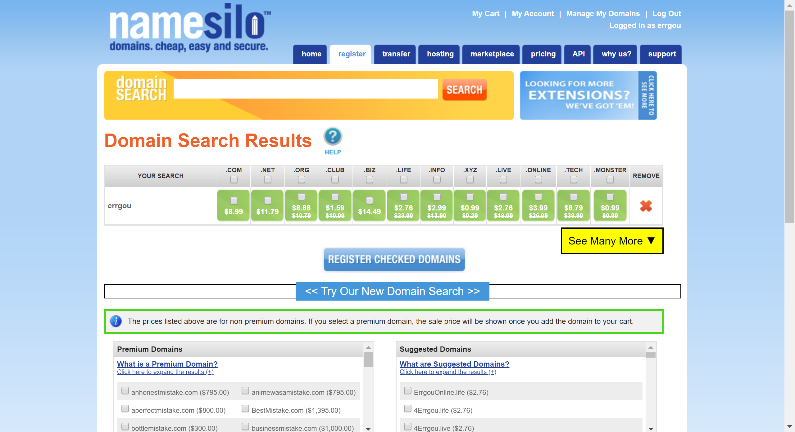
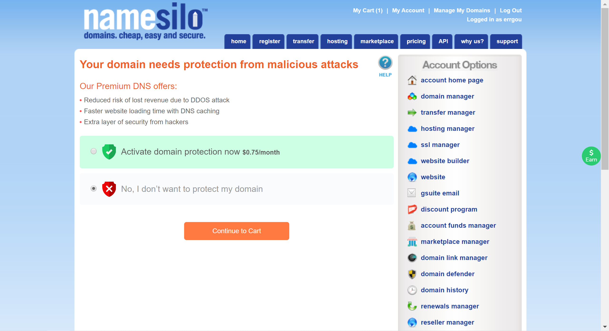
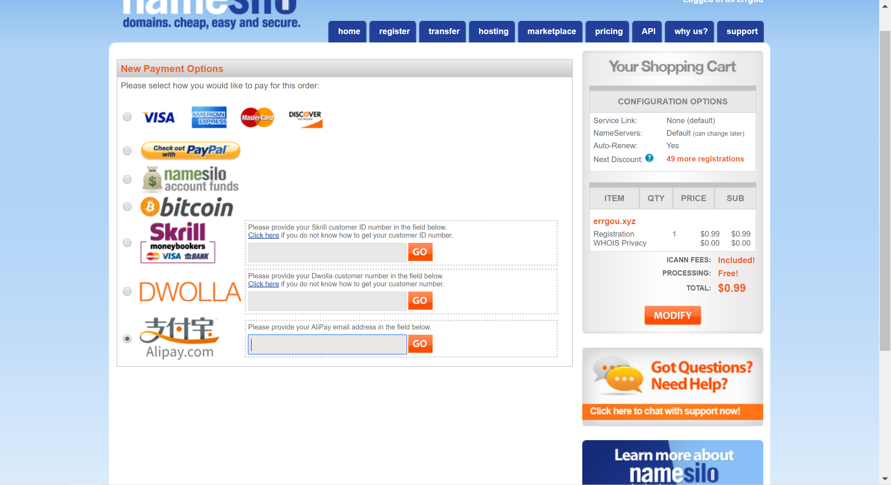
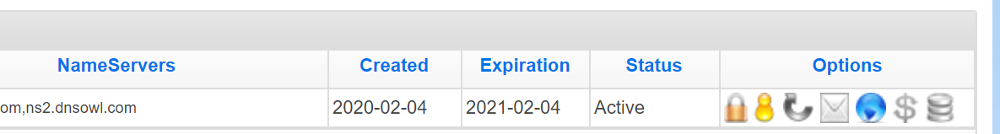
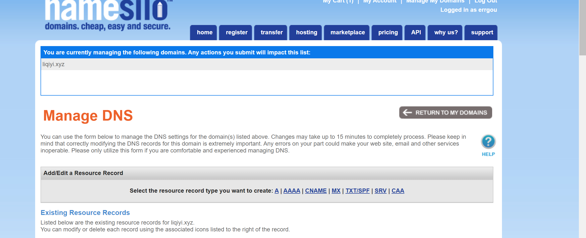
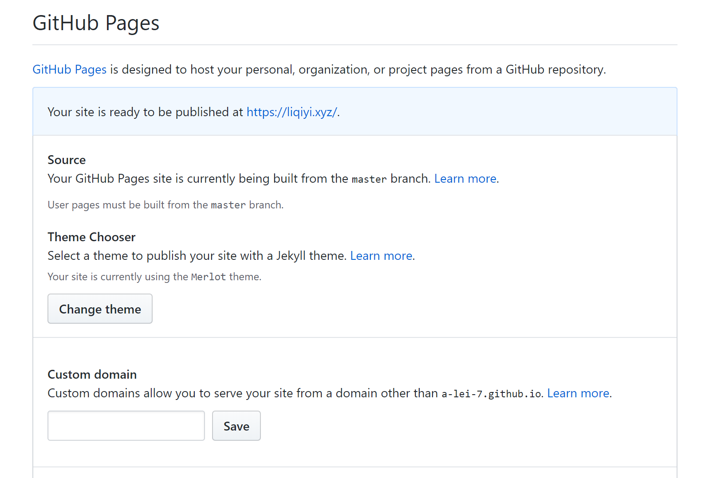
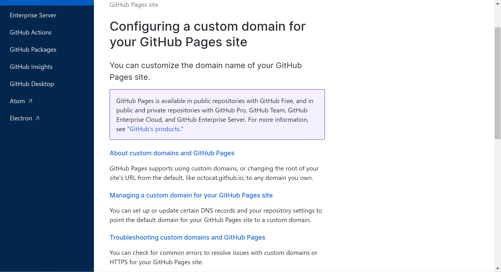
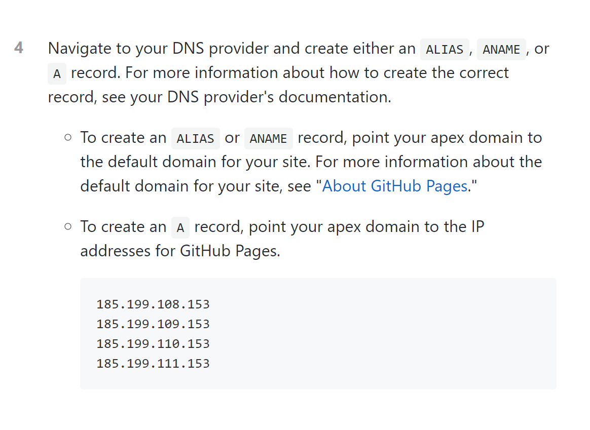

## 通过Hugo 和 Git，搭建一个属于自己的博客

### 首先需要先下载Hugo的安装包：

* 可以直接在 Google 搜索 Hugo Releases

点击第一个链接[https://github.com/gohugoio/hugo/releases](https://github.com/gohugoio/hugo/releases)

然后选择自己电脑对应的版本“hugo_0.64.1_Windows-64bit.zip”

依旧在D:\Software建立文件夹：hugo，将文件“hugo.exe”放置其中，并按照如下步骤配置环境变量

对我的电脑>右键选择属性>高级系统设置>环境变量>点击下方的Path>点击新建>将hugo的路径粘贴至此即可

接着在通过cmder输入命令行

    hugo --version

若返回hugo的版本信息，说明安装正确，即开始下一步

### 之后可以按照hugo官网给出的指示一步步完成配置信息
点击“Quick Start”

#### 第一步：安装并配置环境变量（这一步已经执行）

#### 第二步：建立一个属于博客的文件夹

    hugo new site quickstart

当中“quickstart”是文件夹名称，可以命名为: git名称.github.io-creator，易于理解

#### 第三步：下载主题

    cd 刚才的目录
    git init
    git submodule add https://github.com/budparr/gohugo-theme-ananke.git themes/ananke
    echo 'theme = "ananke"' >> config.toml

这一步目的是：
1. 建立一个.git本地仓库
2. 下载一个名为"ananke"的主题
3. 然后配置它

#### 第四步：建立一个页面

    hugo new posts/博客主题.md

之后默认内容如下 ：

    ---
    title: "博客主题"
    date: 2019-03-26T08:47:11+01:00
    draft: true
    ---

之后可以在---之下编写博客内容

写完之后记得将上方的"draft: true"更改为：" draft: false"

#### 第五步 ：启动hugo服务器

在命令行内输入以下代码：

    hugo server -D
之后会返回如下值：
~~~

                   | EN
+------------------+----+
  Pages            | 10
  Paginator pages  |  0
  Non-page files   |  0
  Static files     |  3
  Processed images |  0
  Aliases          |  1
  Sitemaps         |  1
  Cleaned          |  0

Total in 11 ms
Watching for changes in /Users/bep/quickstart/{content,data,layouts,static,themes}
Watching for config changes in /Users/bep/quickstart/config.toml
Environment: "development"
Serving pages from memory
Running in Fast Render Mode. For full rebuilds on change: hugo server --disableFastRender
Web Server is available at http://localhost:1313/ (bind address 127.0.0.1)
Press Ctrl+C to stop
~~~

暂且不要关闭，点击底下的链接：
[ http://localhost:1313/]( http://localhost:1313/)

即可在网页当中打开刚才编辑的博客

#### 第六步：自定义网站配置

打开初始文件夹当中的: config.toml
~~~
baseURL = "https://example.org/"
languageCode = "en-us"
title = "My New Hugo Site"
theme = "ananke"
~~~

第二行配置语言，可以更改为：

    languageCode = "zh-hans"

最后一行为设置主题信息

    theme = "ananke"

可以在官网的[主题区](https://themes.gohugo.io/),选择心仪的主题

点击进去，找到下面这样的下载链接：

    git clone https://github.com/kimcc/hugo-theme-noteworthy.git themes/noteworthy

在命令行运行上面代码之后，即可在themes文件夹之下下载新的主题代码文件夹

之后再在网站配置：
    config.toml

    theme = "ananke"

将"ananke"更换为新下载的主题名称，再重新运行即可。

#### 第七步：保存静态页面

在命令行运行

    hugo -D

即可将网页保存至 
    public 
文件夹内

#### 至此博客的配置便告一段落，接下来说如何将博客代码上上传至github

## 如何将这部分代码备份到git

此时我们需要将
    public
网页文件夹和
    博客的总文件夹
分别上传到
    git
上面
### 第一步：将public和这个文件夹分离

需要在总的文件夹内新建一个名为
    .gitignore
的文件
在当中写入

    /public/
意为在上传总文件夹的时候，忽略
    public
文件夹

然后进入
    public
文件夹，运行

    git init
在
    public
文件夹内建立.git仓库

### 第二步：在github建立一个新的仓库，名称可以为：
    git名字.github.io
然后选择ssh，粘贴下面代码至命令行

    git remote add origin git@xxxxxxx
    git push -u origin master
完成public部分代码的上传

### 第三步：在github上面，为这个总的文件夹再建一个仓库，以作备份。

新建一个
    git
仓库，然后将
    ssh
代码复制，将命令行切换回这个主文件夹，然后运行

    git remote add origin git@xxxxxxx
    git push -u origin master
这样不论主体和public内容都上传到了
    github

### 在git上面预览博客

进入保存public文件的仓库
点击右上角
    setting

找到
    GitHub Pages
    ，如果下方没有下图绿色提示

可如此设置

之后点击绿色内部的链接，即可浏览博客内容

## 之后就是配置个人域名了

### 首先得有一个域名

下面是国外的一个注册域名的网站，价格较为优惠

[https://www.namesilo.com/](https://www.namesilo.com/)

可以在中间的搜索框，输入自己心仪的字符串，来查找对应的域名存在与否和价格情况

点击Login，然后注册一个账号登录。

选好域名然后添加购物车。

这个选择 
    no
 会便宜一些

再之后进入付款的界面：

选择支付宝，旁边输入支付宝安全邮箱，再之后完成支付即可。

然后点击右上角的

    Manage My Domains

管理域名，点击蓝色的球

点击单个
    “A”
在

    IPV4 ADDRESS
里面输入从git上面得到的地址信息

还是在存放public的仓库，点击
    setting

在框内输入刚刚购买的域名，点击
    Save
然后点击旁边的

    Learn more.

然后点击第二个

翻到这里，然后将下面的这四个地址，分别添加到之前在
    namesilo
上面的域名配置里面

然后将自己配制的四个“A”保留，其他的原始配置全部删除。

### 至此域名配置完成

#### 最后检验一下

打开命令行，输入：

    nslookup 你的域名

如果返回的值里面有你刚才配置的四个地址，那么说明配置成功

之后就可以通过这个域名访问博客内容

#### 不过这个域名配置可能需要比较长的时间，所以耐心等待就好啦。

### 这篇关于配置hugo的博客到这里就要结束了，感谢观看。

###### ending
